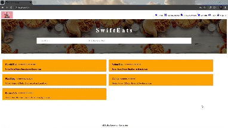

# SwiftEats 🍔
SwiftEats is an intuitive and efficient food delivery platform where restaurants, users, and delivery personnel come together. Built using Next.js, MongoDB, and React, SwiftEats offers a seamless experience for food enthusiasts, restaurant owners, and delivery personnel.

## 🚀 Features


### 👩‍🍳 Restaurant Owner:
**Add Food Items:** Restaurants can add new food items with details like name, price, and description.

**Edit Items:** Modify existing food items.

**Delete Items:** Remove food items that are no longer available.


### 👤 User:
**Restaurant Search:** Users can search restaurants by city or restaurant name.

**Order Food:** Add food items to the cart and place an order.

**Cancel Orders:** Cancel an order if needed.

**Order History:** Check past orders to keep track of purchases.

**Total Bill Calculation:** View the total bill for an order, including food charges, tax, and delivery charges.


### 🚚 Delivery Man:

**Order Assignment:** Take orders based on the city location.

**Order History:** Check previously delivered orders.

## 🛠️ Technologies Used

**Frontend:** Next.js

**Backend:** Node.js

**Database:** MongoDB

**Styling:** CSS for UI design.

**Icons:** React Icons

**Authentication:** User login and registration system for secure access.


## 📦 Dependencies

### Core Dependencies:
**Next.js:** ^14.1.0

**React:** ^18

**React-DOM:** ^18

**Mongoose:** ^8.6.3

**React Icons:** ^5.3.0

### Development Scripts:
**dev:** Start the development server.

**build:** Create a production build.

**start:** Start the production server.

**lint:** Run linting checks.


## ⚙️ How to Run Locally
**Clone the Repository:**
  ```bash
    git clone https://github.com/AdilHasanShojib/University-Talent-Showcase.git
    cd restaurants
  
  ```

**Install Dependencies:**
```bash
    npm install
  ```

**Set Up Environment Variables:** Create a .env file in the root directory with the following variables:

```env
MONGODB_URI=<Your MongoDB Connection URI>
JWT_SECRET=<Your JWT Secret Key>
```
**Run the Application:**
```bash
npm run dev
```
**Access the Application:** <br>
Open your browser and go to http://localhost:3000.


